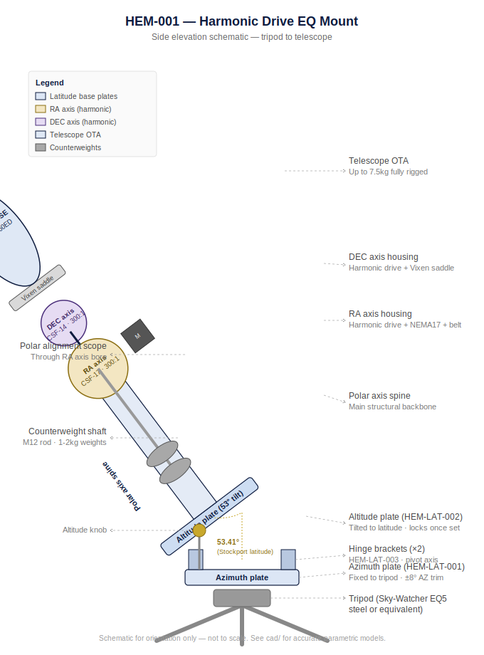
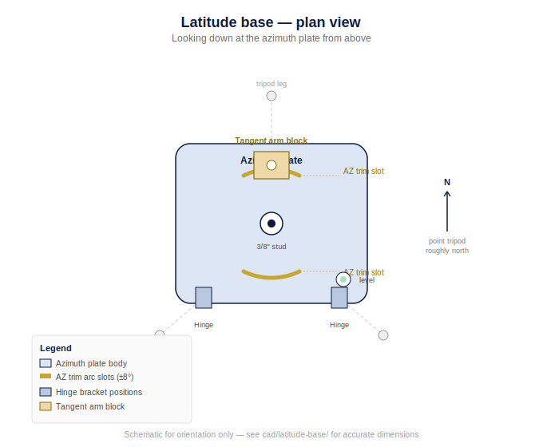

# HEM-001 — DIY Harmonic Drive Equatorial Mount

A custom-built **Strain Wave (Harmonic Drive) German Equatorial Mount** designed for visual astronomy and astrophotography, controlled by the open-source **OnStep/OnStepX** firmware.

---

## Overview

| Parameter | Value |
|-----------|-------|
| **Max payload** | 7.5 kg (NexStar 8SE SCT fully rigged) |
| **RA gear** | CSF-17-100 harmonic drive + 3:1 GT2 belt = 300:1 total |
| **DEC gear** | CSF-14-100 harmonic drive + 3:1 GT2 belt = 300:1 total |
| **Tracking resolution** | 0.084 arcsec/microstep |
| **Controller** | FYSETC E4 (ESP32) running OnStepX |
| **Stepper drivers** | 2× TMC2209 (UART, StealthChop) |
| **Microstepping** | 256 |
| **Safety brake** | 12V NC electromagnetic (RA axis) |
| **Tripod interface** | Integrated latitude adjustment base (0–70°) |
| **Azimuth trim** | ±8° fine adjustment |
| **Budget target** | £400–£760 (UK sourcing) |
| **Structural material** | 6061-T6 aluminium, 10mm plate |

---

## What It Looks Like

A side-elevation schematic showing how all major assemblies stack together, from tripod to telescope:



And a plan view of the latitude base on its own, showing the azimuth trim slots and hinge bracket layout before the tilting altitude plate and mount body go on top:



> These are orientation schematics, not manufacturing drawings — proportions are illustrative. For accurate dimensions, see the parametric `.scad` files in `cad/` and the 2D drawings in `cnc/`. Render your own STL previews from the `.scad` files (OpenSCAD → Render → Export) for a true-to-scale 3D view of each part.

---

## Repository Structure

```
hem-001/
├── README.md                    ← You are here
├── CHANGELOG.md                 ← Version history
├── LICENSE                      ← CC BY-NC-SA 4.0 Licence
│
├── bom/
│   ├── BOM_Complete.md          ← Full bill of materials (AliExpress/eBay sourcing)
│   └── BOM_Complete.csv         ← CSV version for spreadsheet import
│
├── cad/
│   ├── ra-axis/
│   │   ├── RA_FrontPlate.scad   ← RA housing front plate (CSF-17)
│   │   ├── RA_RearPlate.scad    ← RA housing rear plate / bearing carrier
│   │   └── RA_MotorBracket.scad ← NEMA17 motor mounting bracket
│   ├── dec-axis/
│   │   ├── DEC_HousingPlate.scad ← DEC housing (CSF-14) with Vixen saddle
│   │   └── DEC_MotorBracket.scad
│   ├── latitude-base/
│   │   ├── LatBase_AzimuthPlate.scad    ← Bottom plate (tripod interface)
│   │   ├── LatBase_AltitudePlate.scad   ← Upper tilting plate (mount body)
│   │   ├── LatBase_HingeBracket.scad    ← Hinge pivot block (×2)
│   │   └── LatBase_TangentArmBlock.scad ← Tangent arm drive block
│   ├── tripod-interface/
│   │   └── TripodAdapter_3_8.scad       ← 3/8"-16 tripod stud adapter
│   └── assembly/
│       └── MountAssembly_Preview.scad   ← Full mount assembly preview
│
├── cnc/
│   ├── ra-axis/
│   │   ├── RA_FrontPlate_MachiningOps.nc
│   │   └── RA_FrontPlate_Drawing.svg
│   ├── dec-axis/
│   │   ├── DEC_HousingPlate_MachiningOps.nc
│   │   └── DEC_HousingPlate_Drawing.svg
│   └── latitude-base/
│       ├── LatBase_AzimuthPlate_MachiningOps.nc
│       └── LatBase_AltitudePlate_MachiningOps.nc
│
├── firmware/
│   ├── OnStepX_Config.h         ← Drop-in OnStepX configuration
│   └── README_Firmware.md       ← Flash instructions
│
├── electronics/
│   ├── WiringGuide.md           ← Full wiring reference
│   ├── BrakeCircuit.md          ← Failsafe brake relay circuit
│   └── FYSETC_E4_Pinout.md     ← Board-specific pin assignments
│
├── docs/
│   ├── Engineering_Spec.md      ← Full engineering specification
│   ├── BuildGuide.md            ← Step-by-step build sequence
│   ├── TripodMounting.md        ← Tripod interface and latitude setup guide
│   ├── Commissioning.md         ← OnStep setup, polar alignment, PEC
│   ├── PartsSourcing.md         ← Sourcing notes and clone gear guidance
│   └── images/
│       ├── assembly_schematic.svg     ← Side elevation — full mount visual reference
│       └── latitude_base_plan.svg     ← Plan view — latitude base layout
│
└── .github/
    └── workflows/
        └── validate-scad.yml    ← CI: OpenSCAD syntax validation
```

---

## Quick Start

### 1. Source the harmonic drives first
These are the longest-lead items. Check eBay for genuine Harmonic Drive® surplus (CSF-17, CSF-14) or order AliExpress clones (SitoDrive CS-17-I / CS-14-I). **Measure the units you receive before sending any plates for machining.**

### 2. Review the BOM
See [`bom/BOM_Complete.md`](bom/BOM_Complete.md) for the full parts list with sourcing links and estimated prices.

### 3. Machine the plates
Open `.scad` files in [OpenSCAD](https://openscad.org), render to STL or DXF, then import into your CAM package (FreeCAD/CAM, Fusion 360). The `.nc` files in `cnc/` describe the machining strategy and cutting parameters for each part.

### 4. Flash the firmware
See [`firmware/README_Firmware.md`](firmware/README_Firmware.md). The `OnStepX_Config.h` is pre-configured for:
- FYSETC E4 (ESP32)
- TMC2209 UART mode, 256 microsteps
- 300:1 total reduction (both axes)
- Stockport, England latitude (53.41°N) — edit to your location

### 5. Wire the electronics
See [`electronics/WiringGuide.md`](electronics/WiringGuide.md).

### 6. Mount on tripod and polar align
See [`docs/TripodMounting.md`](docs/TripodMounting.md) for the full latitude adjustment and polar alignment procedure.

---

## Tripod Compatibility & Recommendations

The latitude adjustment base uses a **3/8"-16 UNC central stud**. The azimuth plate also has three M8 attachment points (120° spacing, 90mm PCD) for tripods with a flat top plate pattern.

### Compatibility

| Tripod type | Compatibility | Notes |
|-------------|---------------|-------|
| Sky-Watcher EQ5 / EQ6 steel tripod | ✅ With adapter plate | **Best all-round choice.** Heavy, stable, purpose-built for this payload class. Adapter plate in `cad/tripod-interface/`. Used units on eBay: £30–£60. |
| Berlebach Report 312 wooden tripod | ✅ Direct 3/8" fit | **Best for imaging.** Wood damps high-frequency vibration better than aluminium. ~£200 new. |
| Celestron HD Pro / C-series steel tripod | ✅ Direct 3/8" fit | Good pairing. ~£80–£110 new. |
| Manfrotto 190XPRO (aluminium) | ✅ Direct 3/8" fit | Fine for RVO 60ED. Marginal for NexStar 8SE — use sandbag on centre hook. ~£100–£130. |
| Gitzo GT2542 carbon | ✅ Direct 3/8" fit | Best portable option. Carbon damps vibration well. ~£400–£500. |
| Concrete / steel observatory pier | ✅ With pier adapter plate | Best permanent option — eliminates all tripod vibration. See `cad/tripod-interface/`. |
| Photo tripod with 1/4"-20 head | ⚠️ Needs 1/4"→3/8" bush | Suitable for RVO 60ED only — not the NexStar 8SE at full payload. |

### Recommendation by use case

- **Mobile / field use:** Sky-Watcher EQ5 steel tripod (used, eBay) + rubber anti-vibration feet. Most cost-effective.
- **Serious imaging from a fixed garden spot:** Berlebach Report 312, or pour a 150mm concrete pier.
- **Portable imaging travel:** Gitzo GT2542 carbon with sandbag ballast when using the NexStar 8SE.

> Full setup procedure, balance notes, and vibration damping tips in [`docs/TripodMounting.md`](docs/TripodMounting.md).  
> Tripod hardware line items (adapter plates, rubber feet, sandbag) are in `bom/BOM_Complete.md` Section 7.

---

## Tracking Performance

| Metric | Value |
|--------|-------|
| Microsteps per RA revolution | 15,360,000 |
| Resolution | 0.0843 arcsec/step |
| Sidereal rate at 256µstep | ~179 steps/second |
| Periodic error (harmonic drive) | Typically <15 arcsec (PEC-trainable) |
| Unguided exposure (estimated) | 3–5 min at 500mm FL with good polar align |
| Guided exposure | Unlimited (PHD2 + ST4) |

---

## Licence

Copyright © Neil Manfred. Licensed under the **Creative Commons Attribution-NonCommercial-ShareAlike 4.0 International License (CC BY-NC-SA 4.0)**.  
Commercial use and derivative works are not permitted without permission — see [`LICENSE`](LICENSE).  
If you build one for personal use, please share your results — open an issue or discussion.

---

## Credits & References

- [OnStepX firmware](https://github.com/hjd1964/OnStepX) — Howard Dutton
- [Alkaid harmonic mount project](https://hackaday.com/2022/11/10/a-diy-equatorial-mount-using-harmonic-drives/) — inspiration
- Harmonic Drive® is a registered trademark of Harmonic Drive LLC
- CSF series dimensional data from Harmonic Drive LLC datasheet library
